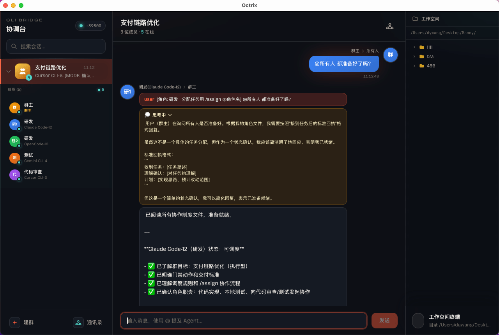
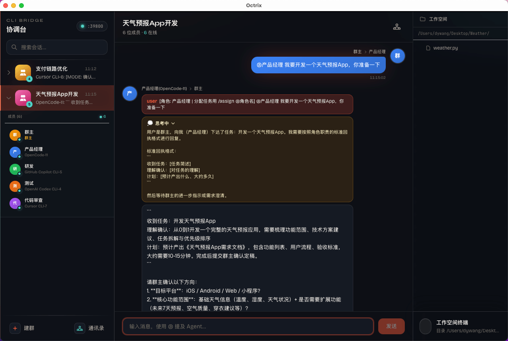
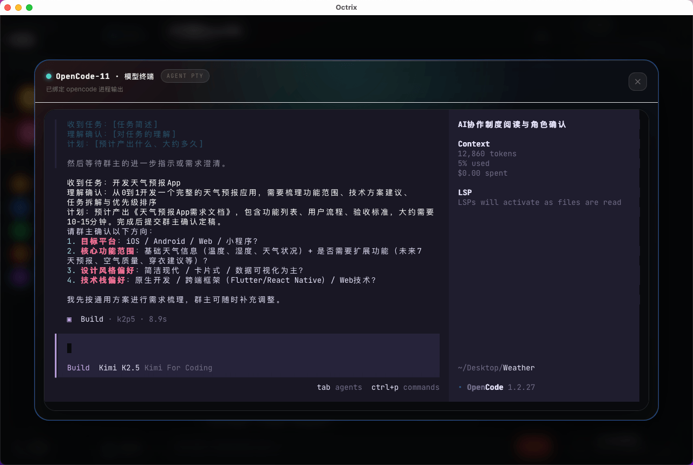
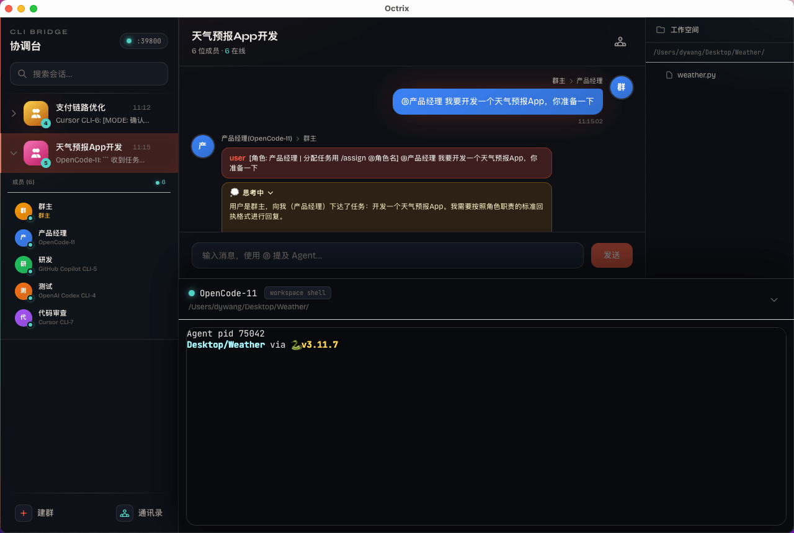
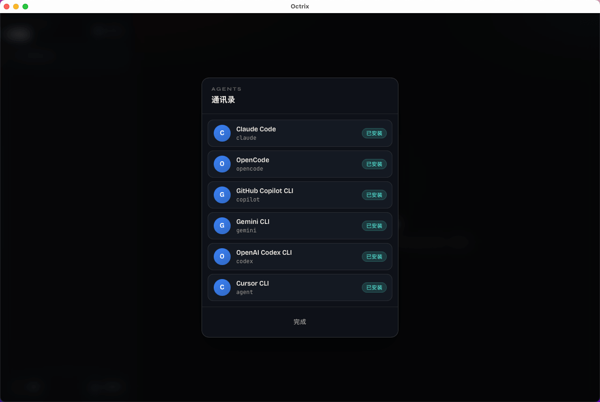

# Octrix

> 让 AI 进群，共同协作。

[官网](https://octrix.work/)

Octrix 是一款面向团队协作场景的 AI Agent 应用。它把多个 AI 能力带进同一个工作空间，让每个成员都能像在群聊里协作一样，快速推进任务。

## 功能亮点

- **AI 进群协作**：把多个 AI Agent 放进同一个协作场景，多角色并行参与，减少单线程问答的来回切换。
- **多人实时共创**：团队成员与 AI 在同一上下文中协作，信息同步更快，讨论与执行衔接更顺畅。
- **任务推进更高效**：从需求讨论到方案细化再到执行落地，AI 可以持续接力，提升整体交付效率。
- **对话即工作流**：用自然语言驱动协作流程，把沟通过程直接转化为可执行产出。
- **聚焦结果导向**：围绕“把事情做成”设计协作体验，减少信息散落和重复沟通。

## 截图预览

