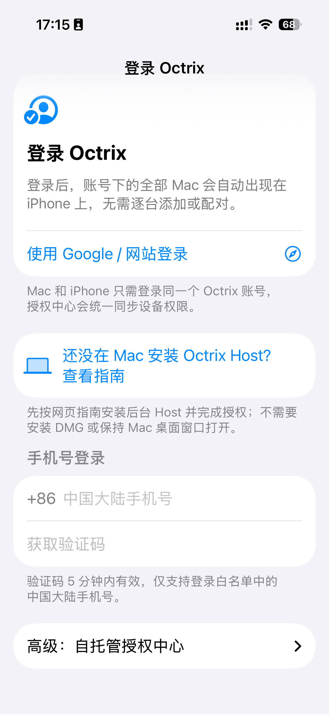
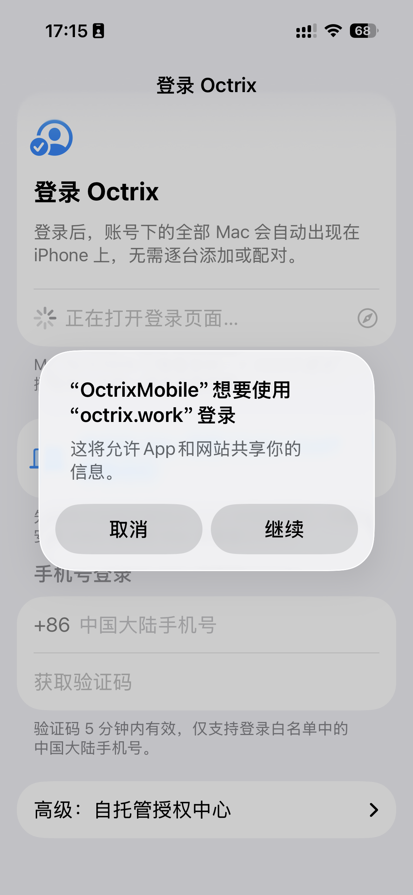
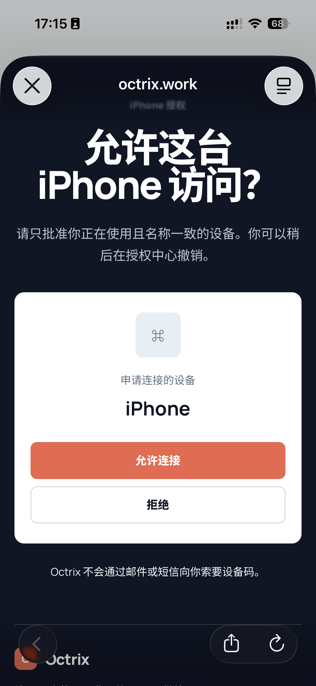
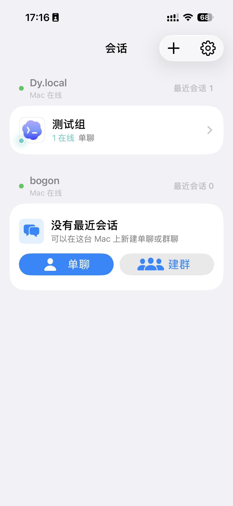
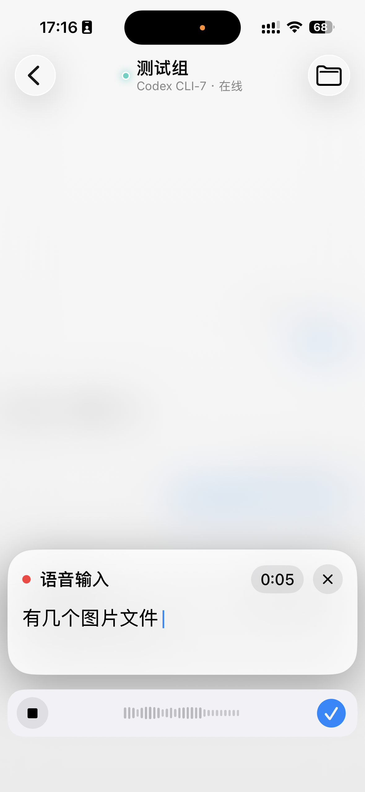
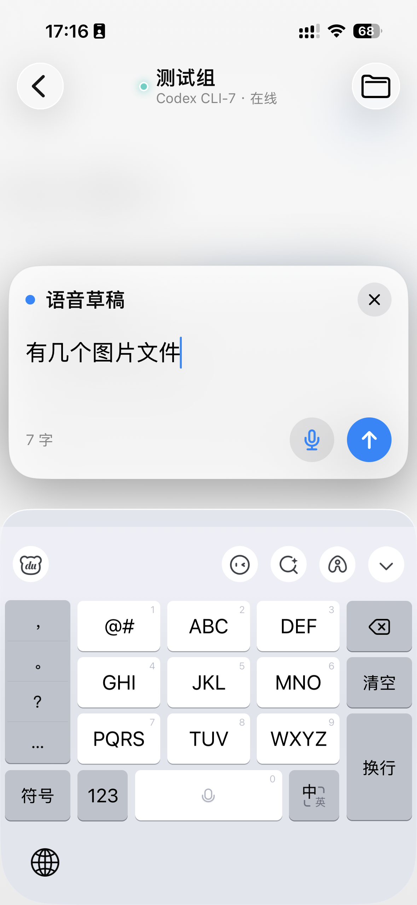
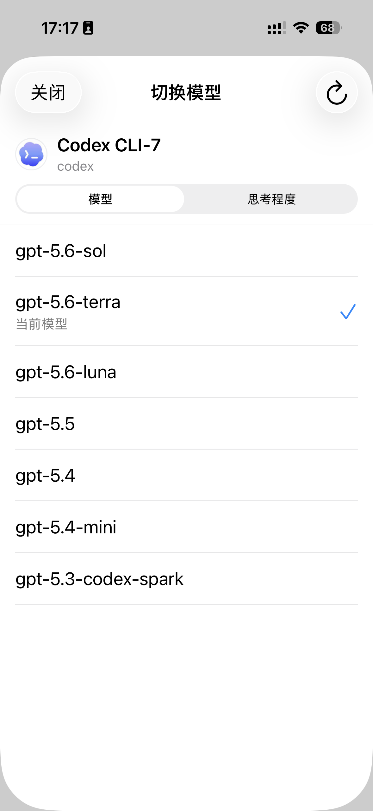
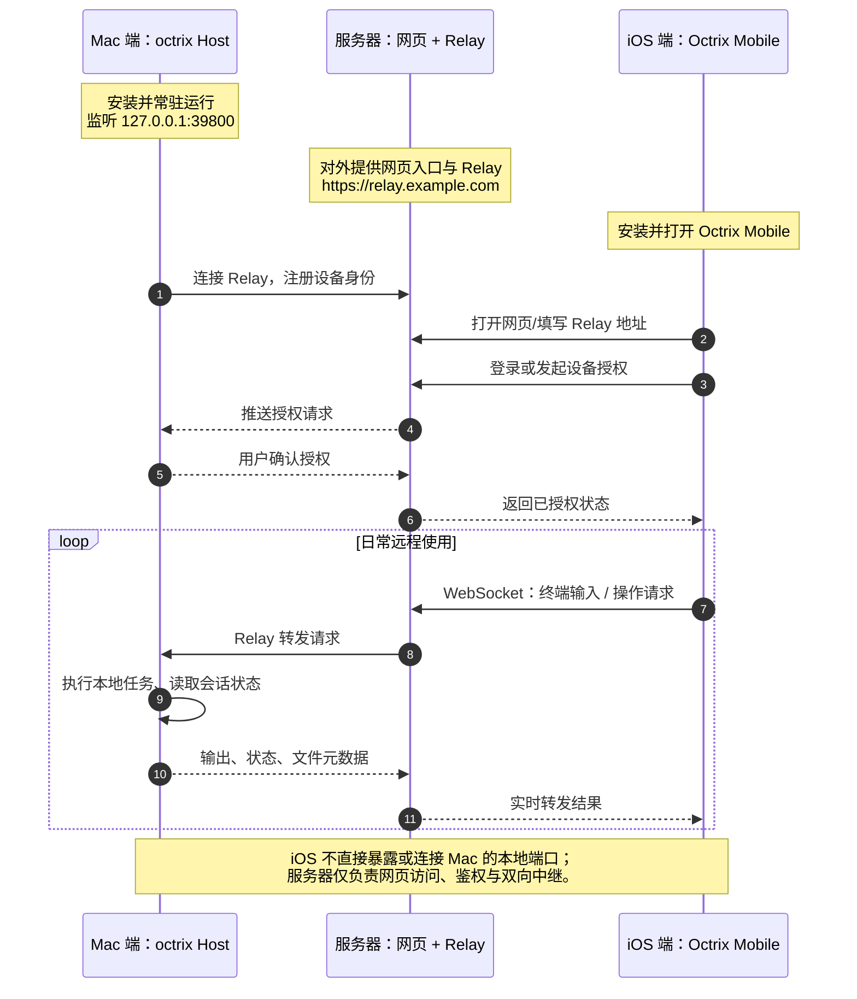

# OctrixAI

**[在 App Store 下载 Octrix](https://apps.apple.com/cn/app/octrix/id6786918049)**

OctrixAI 让你从 iPhone 安全连接本人 Mac 上的 AI CLI，会话和任务由常驻的 Octrix Host 管理，并通过 Octrix Cloud 在已授权设备之间同步。

## 使用官方服务快速开始

不需要自行部署服务器，使用官方 [Octrix Cloud](https://octrix.work) 即可。完整网页引导见 [octrix.work/start](https://octrix.work/start)，通常约 3 分钟完成。

### 开始之前

- 准备一台可使用终端的 Mac，以及一台可安装 Octrix 的 iPhone。
- Mac 和 iPhone 都需要能够访问互联网；Mac 无需公网 IP，也不用开放入站端口。
- 两台设备必须登录同一个 Octrix 账号。

### 1. 注册或登录 Octrix 账号

打开 [octrix.work/start](https://octrix.work/start)，进入登录页面，使用页面提供的 Google 或短信方式注册或登录。后续授权 Mac、登录 iPhone 时，都要使用这个账号。

### 2. 在 Mac 安装 Octrix Host

在 Mac 打开“终端”，复制安装页提供的整行命令并执行。官方服务使用的命令如下：

```bash
curl -fsSL 'https://octrix.work/install-host.sh' | OCTRIX_CLOUD_URL='https://octrix.work' bash
```

安装器会自动识别 Apple 芯片或 Intel 芯片，下载对应的 Host，并将其注册为登录后常驻服务。关闭浏览器或终端不会中断正在运行的 AI 任务。

首次安装时，终端会提示你按回车申请“桌面、文稿和下载”文件夹权限。请在随后出现的 macOS 系统弹窗中逐项选择“允许”，方便以后从 iPhone 远程选择工作目录。

### 3. 在网页授权这台 Mac

安装完成后，浏览器会自动打开 Octrix 授权页面。使用第 1 步的账号登录，确认“允许连接”这台 Mac。终端显示“连接：在线”后，Host 已上线并等待 iPhone 连接。

安装器同时提供以下命令：

| 命令 | 用途 |
| --- | --- |
| `octrix status` | 检查 Host、账号和云端连接状态 |
| `octrix auth` | 重新打开网页登录授权 |
| `octrix webtui` | 打开 `http://127.0.0.1:39800/` 的本地 Web 终端 TUI |
| `octrix restart` | 重启后台 Host |
| `octrix logout` | 退出账号、撤销这台 Mac 的设备凭证并断开云端连接 |

### 4. 安装并登录 iPhone 客户端

按照 [octrix.work/start](https://octrix.work/start) 的 iPhone 指引安装 Octrix。打开 App 后选择“登录并连接”，使用第 1 步的同一个账号登录，并按页面提示允许这台 iPhone 访问账号。

iOS 会通过系统安全浏览器完成登录，再通过 `octrix://auth` 返回一次性授权码。长期客户端凭证只保存在 iOS Keychain。

### 5. 选择 Mac 并开始使用

登录完成后，账号下已授权的 Mac 会自动出现，无需填写服务器地址或手工配对。选择目标 Mac，在会话页点击“+”，即可新建任务、单聊或协作群。

也可以在 Mac 运行 `octrix webtui`，通过本地 Web TUI 管理同一套 AI 进程和会话。

### iPhone 客户端界面

<p align="center">
  
  
  
</p>

<p align="center">
  
  
  
  
</p>

### 常见问题

- **iPhone 看不到 Mac**：确认两端登录的是同一个账号；在 Mac 运行 `octrix status`，连接应显示为“在线”。
- **Mac 显示离线**：先运行 `octrix restart`，再检查 `octrix status`；如果账号已退出，运行 `octrix auth` 重新授权。
- **需要撤销设备**：在 [授权中心](https://octrix.work/dashboard) 的设备列表中点击“撤销”。该设备的现有连接会立即断开。

## 产品组成与支持范围

OctrixAI 由三个交付物组成，客户端源码统一放在 `client/` 下：

- `client/web/`：独立常驻的 Mac Host 与正式本地 Web TUI。Tauri/Electron 源码保留，但当前暂停适配和发布。
- `relay/`：Octrix Cloud，统一提供官网、账号登录、设备授权和远程隧道。
- `client/ios/`：通过 Octrix Cloud 安全访问本人 Mac 的 iPhone 客户端。

当前产品开放以下全部已适配的 Agent CLI；本地 Web TUI、Host API 与 iOS 使用同一启用目录。

| Agent CLI | 本地命令 | 状态 |
| --- | --- | --- |
| Codex CLI | `codex` | 已开放 |
| OpenClaude | `openclaude` | 已开放 |
| Claude Code | `claude` | 已开放 |
| OpenCode | `opencode` | 已开放 |
| GitHub Copilot CLI | `copilot` | 已开放 |
| Gemini CLI | `gemini` | 已开放 |
| Cursor CLI | `agent` | 已开放 |
| Kiro CLI | `kiro-cli` | 已开放 |
| Qoder CLI | `qodercli` | 已开放 |
| CodeBuddy | `codebuddy` | 已开放 |

## 统一授权架构

默认的 Octrix Cloud 运行在 [octrix.work](https://octrix.work)。Mac 和 iPhone 通过同一网站登录，同一账号只能发现和控制自己名下的设备。Mac 不需要公网 IP，也不开放入站端口。

自托管时，将服务器的 `OCTRIX_PUBLIC_URL` 设置为自己的 HTTPS 域名。网页会生成携带该域名的 Mac 安装命令，iOS 也可在“高级：自托管授权中心”中填写它。

### 三端交互泳道图


```mermaid
sequenceDiagram
    autonumber
    participant Mac as Mac 端：octrix Host
    participant Server as 服务器：网页 + Relay
    participant iOS as iOS 端：Octrix Mobile

    Note over Mac: 安装并常驻运行<br/>监听 127.0.0.1:39800
    Note over Server: 对外提供网页入口与 Relay<br/>https://relay.example.com
    Note over iOS: 安装并打开 Octrix Mobile

    Mac->>Server: 连接 Relay，注册设备身份
    iOS->>Server: 打开网页/填写 Relay 地址
    iOS->>Server: 登录或发起设备授权
    Server-->>Mac: 推送授权请求
    Mac-->>Server: 用户确认授权
    Server-->>iOS: 返回已授权状态

    loop 日常远程使用
        iOS->>Server: WebSocket：终端输入 / 操作请求
        Server->>Mac: Relay 转发请求
        Mac->>Mac: 执行本地任务、读取会话状态
        Mac-->>Server: 输出、状态、文件元数据
        Server-->>iOS: 实时转发结果
    end

    Note over Mac,iOS: iOS 不直接暴露或连接 Mac 的本地端口；<br/>服务器仅负责网页访问、鉴权与双向中继。
```

## 从源码安装 Mac Host

运行根目录脚本会构建并安装独立的 Octrix Host、注册登录后常驻服务，并引导网页登录。无需安装 DMG：

```bash
./run-mac.sh
```

首次安装会在终端提示按回车申请“桌面、文稿和下载”访问权限。请在随后出现的 macOS 系统弹窗中逐项允许。需要重新申请时运行 `octrix permissions`。

从源码安装到自托管 Relay 时，在安装命令前传入公网地址；它会被保存到 Host 的 LaunchAgent，重启后仍然生效：

```bash
OCTRIX_CLOUD_URL=https://relay.example.com ./run-mac.sh
```

若这台 Mac 已登录过其他 Relay，切换地址会清除旧服务器的设备凭证；随后运行 `octrix auth` 为新服务器重新授权。

安装后可直接使用：

```bash
octrix auth
octrix auth --device-code
octrix status
octrix webtui
octrix restart
octrix permissions
octrix logs
octrix logout
```

`octrix auth` 会打开浏览器完成授权；`octrix webtui` 打开 `http://127.0.0.1:39800/` 上的完整本地 Web TUI。Host 持有 AI 进程、PTY、会话缓冲和云端连接，关闭浏览器不会结束 AI，也不会让 iPhone 离线。

设备凭证保存在 macOS 钥匙串，状态接口和配置文件不会返回明文令牌。

## iPhone 自托管配置

自托管发行版可在 Xcode Build Settings 中设置 `OCTRIX_CLOUD_URL=https://relay.example.com`，改变 App 的默认授权中心。

高级设置允许临时填写其他自托管地址，但不接受手工共享令牌。旧版手动令牌不会上传到网站，升级后需要重新登录。

## 本地开发

依赖分别安装，不要在仓库根目录统一安装。

```bash
cd client/web && npm install && npm run dev
cd relay && npm install && npm run dev
```

常用验证：

```bash
cd client/web && npm test && npm run build
cd relay && npm test && npm run typecheck && npm run build
cd client/ios && xcodebuild -project OctrixMobile.xcodeproj -scheme OctrixMobile \
  -destination 'generic/platform=iOS Simulator' build CODE_SIGNING_ALLOWED=NO
```

## 本机开发服务

仓库调试时可使用开发 LaunchAgent 运行 Vite 和源码服务；它不是正式 Host 安装方式：

```bash
launchctl bootout gui/$(id -u) ~/Library/LaunchAgents/com.octrix.local-dev.plist 2>/dev/null || true
launchctl enable gui/$(id -u)/com.octrix.local-dev
launchctl bootstrap gui/$(id -u) ~/Library/LaunchAgents/com.octrix.local-dev.plist
launchctl kickstart -k gui/$(id -u)/com.octrix.local-dev
curl http://127.0.0.1:9800/v1/health
curl http://127.0.0.1:9800/api/relay/status
```

日志位于仓库根目录 `.run-mac-web.log`。

## Host 发布

默认发布流程只构建并上传双架构 Host 与 SHA-256 校验文件，不构建 DMG：

```bash
cd client/web
./publish-release.sh 1.0.3 both
```

Host 版本必须显式使用 `MAJOR.MINOR.PATCH` 三段式格式；`both` 会同时生成 Apple Silicon 与 Intel 安装包。

macOS 原生 App、Tauri/Electron 与 DMG 当前暂停维护。历史源码和明确命名的 `client/web/publish-macos-release.sh` 仅作为未来恢复适配时的备用入口，日常发布不得调用。

正式 Host 默认监听 `127.0.0.1:39800`，由 `~/Library/LaunchAgents/work.octrix.host.plist` 管理。源码开发服务仍使用 `9800`：

```bash
curl http://127.0.0.1:39800/v1/health
launchctl print gui/$(id -u)/work.octrix.host
```

## Octrix Cloud 自托管部署

生产环境使用 `relay/deploy/docker-compose.yml`：

- 容器：`octrix-cloud`
- 主机监听：`127.0.0.1:18083`
- 数据目录：由部署者配置的受限目录
- 备份目录：由部署者配置的受限目录
- Nginx：将你的 Relay 域名代理到仅监听回环地址的容器端口

复制 `relay/deploy/.env.example` 为部署目录中的 `.env` 后，必须将 `OCTRIX_PUBLIC_URL` 改为实际对外 HTTPS 地址，并将同一地址登记为 Google OAuth 回调的前缀。

`relay/deploy/nginx-octrix.work.conf` 是可替换域名的 Nginx 模板，证书路径与 `server_name` 也应一并修改。部署文件和运维命令见 [relay/README.md](relay/README.md)，远程访问协议和安全模型见 [docs/remote-access.md](docs/remote-access.md)。

生产检查：

```bash
curl https://relay.example.com/healthz
curl https://relay.example.com/readyz
ssh <deploy-host> 'cd <deploy-dir> && sudo docker compose ps'
```

Google、阿里云、App Review 固定验证码、令牌 pepper 和兼容期旧凭证只允许保存在服务器 `.env`，不得写入仓库或日志。旧授权兼容开关最多保留 7 天；全部设备重新登录后应立即关闭并删除旧凭据。

## 安全边界

- `relay:device` 令牌只能注册对应 Mac，不能读取设备列表。
- `relay:client` 令牌只能访问同账号 Mac，不能注册设备。
- 授权码、OAuth state 和令牌只在云端保存带 pepper 的哈希。
- 撤销设备或会话时，现有 WebSocket 会立即关闭。
- 网站只管理账号和授权，不提供浏览器远程控制；远程操作由 iOS 客户端完成。

贡献与安全报告请参见 [CONTRIBUTING.md](CONTRIBUTING.md) 和 [SECURITY.md](SECURITY.md)。数据流与自托管责任见 [docs/data-handling.md](docs/data-handling.md)。
